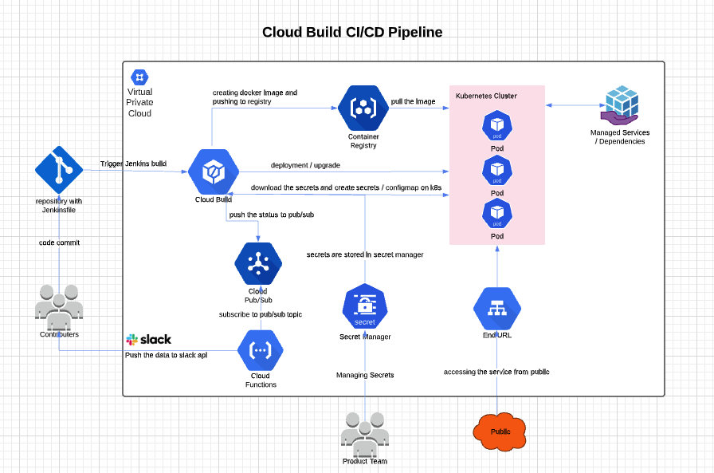
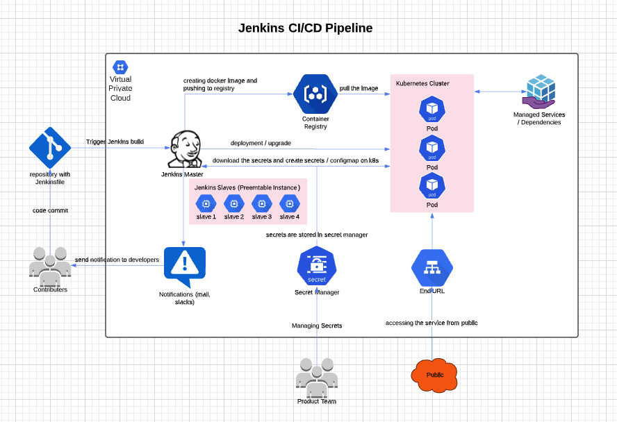

# gcp-cicd-sample

sample application CI/CD


### Set the project id to the environment variable

```
export PROJECT_ID=test-project
export PROJECT_NUMBER=$(gcloud projects list  | grep $PROJECT_ID | awk '{print $3}')
export SECRET_NAME=newsecret
```

### Create the secret manager and initialise the first version of secrets

**Note : update the ./k8s/secret-configmap.yaml file before the secret version initialing**

```
gcloud secrets create ${SECRET_NAME} --labels="keyowner=devops" --project=${PROJECT_ID}
gcloud secrets versions add ${SECRET_NAME} --data-file=./k8s/secret-configmap.yaml
```

### Update the secret configmap / edit the configmap and push it back to secret manager

**Note :  update the environment variables (The secret version to be used to edit and update)**

```
export SECRET_VERSION=1
```

```
SECRET_FILE=$(mktemp ./temp_secret.XXXXXXXXX) && gcloud secrets versions access ${SECRET_VERSION} --secret=${SECRET_NAME} > ${SECRET_FILE} && vim ${SECRET_FILE} && gcloud secrets versions add ${SECRET_NAME} --data-file=${SECRET_FILE} --project=${PROJECT_ID} ; rm -rf ${SECRET_FILE}
```


## Cloudbuild CI/CD workflow




Give k8s developer permission to the cloudbuild service account.

```shell
gcloud projects add-iam-policy-binding ${PROJECT_ID} --member serviceAccount:${PROJECT_NUMBER}@cloudbuild.gserviceaccount.com --role roles/container.developer
```

Give cloud function developer permission to the cloudbuild service account. (required only if the cloud function update automatically with cloudbuild)

```shell
gcloud projects add-iam-policy-binding ${PROJECT_ID} --member serviceAccount:${PROJECT_NUMBER}@cloudbuild.gserviceaccount.com --role roles/cloudfunctions.developer
gcloud projects add-iam-policy-binding ${PROJECT_ID} --member serviceAccount:${PROJECT_NUMBER}@cloudbuild.gserviceaccount.com --role roles/iam.serviceAccountUser
```

Give the `secretmanager.secretAccessor` permission to the cloudbuild service account. This is required for download/decrypt secrets.

```shell
gcloud projects add-iam-policy-binding ${PROJECT_ID} --member serviceAccount:${PROJECT_NUMBER}@cloudbuild.gserviceaccount.com --role roles/secretmanager.secretAccessor --condition "expression=(resource.type == 'secretmanager.googleapis.com/SecretVersion' && resource.name.startsWith('projects/${PROJECT_NUMBER}/secrets/${SECRET_NAME}/versions/')),title=Access to ${SECRET_NAME} only"
```

Create cloudbuild with following environment variables

* _SECRET_NAME
* _K8S_NAMESPACE
* _K8S_LOCATION
* _K8S_CLUSTER


### Configuring Slack Notifications for Google Cloud Build


#### Prepare your Slack App

I assume you have Slack installed and that you have created and signed-in to your account.

Create a [new Slack app](https://api.slack.com/apps?new_app=1):

1. Choose the app’s name and your Slack team. Click Create.
2. Click Incoming Webhooks.
3. Activate incoming webhooks.
4. Click Add New Webhook to Workspace. An authorization page opens.
5. From the drop-down menu, select the channel to which you would like notifications sent.
6. Click Authorize.
7. A webhook for your Slack application has been created. Copy the webhook URL and save it for later use.


### Deploy the Cloud Function

**Note : Pass the right values for these Variables while creating the function**

* SLACK_WEBHOOK_URL : slack webhook which created before
* GH_ORG_NAME : GitHub organisation name
* GH_REPO_NAME : List of GitHub repository name (separated by ' ' {space}) --> for python code

## python
```shell
gcloud functions deploy subscribeSlack \
    --source=./python \
    --runtime=python38 \
    --trigger-topic cloud-builds \
    --set-env-vars SLACK_WEBHOOK_URL="https://hooks.slack.com/services/something",GH_ORG_NAME="akhilrajmailbox",GH_REPO_NAME="repo1 repo2 gcp-cicd-sample"
```

## nodejs
```shell
gcloud functions deploy subscribeSlack \
    --source=./node \
    --runtime=node8 \
    --trigger-topic cloud-builds \
    --set-env-vars SLACK_WEBHOOK_URL="https://hooks.slack.com/services/something",GH_ORG_NAME="akhilrajmailbox",GH_REPO_NAME="gcp-cicd-sample"
```

[gcb_slack_base](https://mehmandarov.com/slack-notifications-for-cloud-build/)

[gcb_slack_adv](https://amperon.co/blog/better-gcb-notifications-slack/)


## Jenkins CI/CD workflow




### Create an IAM and grant required permission (Service Account for Deployment)

This user is for deploying the application in an automated way, do not use this service account inside the application

```shell
gcloud iam service-accounts create cicd-deployer --display-name='CICD SA'
```

Grant access to the storage bucket (docker registry bucket) for pull / push the docker images : `legacyBucketWriter` && `objectViewer`

```shell
gsutil iam ch serviceAccount:cicd-deployer@${PROJECT_ID}.iam.gserviceaccount.com:legacyBucketWriter gs://artifacts.${PROJECT_ID}.appspot.com
gsutil iam ch serviceAccount:cicd-deployer@${PROJECT_ID}.iam.gserviceaccount.com:objectViewer gs://artifacts.${PROJECT_ID}.appspot.com
```

Grant Instance admin, Network admin, Service Account permission to the service account for jenkins slave machine provisioning (only required if you are configuring jenkins)

```shell
gcloud projects add-iam-policy-binding $PROJECT_ID --member serviceAccount:cicd-deployer@$PROJECT_ID.iam.gserviceaccount.com --role roles/compute.instanceAdmin.v1
gcloud projects add-iam-policy-binding $PROJECT_ID --member serviceAccount:cicd-deployer@$PROJECT_ID.iam.gserviceaccount.com --role roles/compute.networkAdmin
gcloud projects add-iam-policy-binding $PROJECT_ID --member serviceAccount:cicd-deployer@$PROJECT_ID.iam.gserviceaccount.com --role roles/iam.serviceAccountActor
```

Give k8s developer permission to the cicd-deployer service account.

```shell
gcloud projects add-iam-policy-binding ${PROJECT_ID} --member serviceAccount:cicd-deployer@${PROJECT_ID}.iam.gserviceaccount.com --role roles/container.developer
```

Give the `secretmanager.secretAccessor` permission to the cicd-deployer service account. This is required for download/decrypt secrets.

```shell
gcloud projects add-iam-policy-binding ${PROJECT_ID} --member serviceAccount:cicd-deployer@${PROJECT_ID}.iam.gserviceaccount.com --role roles/secretmanager.secretAccessor --condition "expression=(resource.type == 'secretmanager.googleapis.com/SecretVersion' && resource.name.startsWith('projects/${PROJECT_NUMBER}/secrets/${SECRET_NAME}/versions/')),title=Access to ${SECRET_NAME} only"
```


### Jenkins Installation (master or slave need to configure accordingly)

[ref](https://www.jenkins.io/doc/book/installing/linux/#debianubuntu)

[jenkins slave on gcp](https://cloud.google.com/solutions/using-jenkins-for-distributed-builds-on-compute-engine)

```shell
# dependencies for jenkisnfile stages
apt-get install -y gettext jq
# java installation
apt-get update
apt-get install openjdk-11-jdk -y
java -version
# docker installation
apt-get install apt-transport-https ca-certificates curl gnupg-agent software-properties-common -y
curl -fsSL https://download.docker.com/linux/ubuntu/gpg | sudo apt-key add -
add-apt-repository    "deb [arch=amd64] https://download.docker.com/linux/ubuntu \
   $(lsb_release -cs) \
   stable"
apt-get update
apt-get install docker-ce docker-ce-cli containerd.io -y
docker version
# kubectl install (1.16 version here)
curl -LO https://dl.k8s.io/release/v1.16.0/bin/linux/amd64/kubectl
install -o root -g root -m 0755 kubectl /usr/local/bin/kubectl
kubectl version --client
# jenkins installation
wget -q -O - https://pkg.jenkins.io/debian-stable/jenkins.io.key | sudo apt-key add -
sh -c 'echo deb https://pkg.jenkins.io/debian-stable binary/ > \
    /etc/apt/sources.list.d/jenkins.list'
apt-get update
apt-get install jenkins -y
systemctl start jenkins
systemctl status jenkins
# grant permission for jenkins group
usermod -aG docker jenkins
```


### Manual configuration for Jenkins

* custom slave image creation with required packages
* add jenkins username / private key configuration in credentials
* image template creation before adding the slave machine
* use the service account for both master and slave machine template / vm